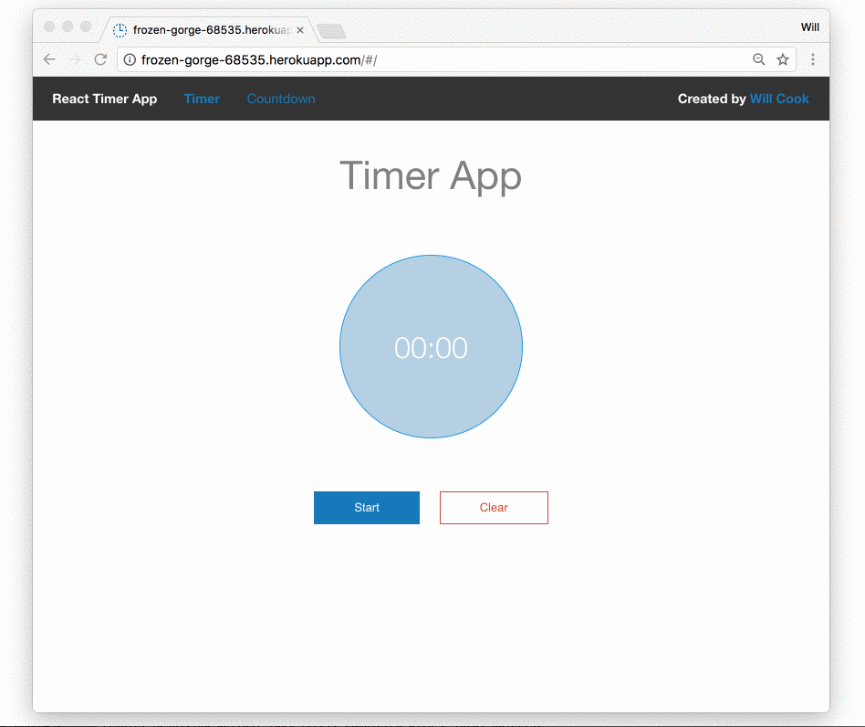

#React Timer App
Simple, clean timer and countdown application. Built with React and tested with Karma.



Try the final result live [here](https://frozen-gorge-68535.herokuapp.com/) or clone this repo and try it locally.

**Built using:**

* **React** - JavaScript Framework
* **Webpack** v2 - Compiling code
* **Babel** - ES6 to ES5 for browser compatibility
* **JavaScript ES6** - Latest JavaScript
* **Karma** - Testing environment
* **Mocha** - Testing Framework
* **Foundation** - Front-end Framework

Run the Karma test suite with
```npm test```

**Sample Output from Karma Testing:**


This project was built as the second project as part of the Complete React Web App Developer Course by Andrew Mead on [Udemy](https://www.udemy.com/the-complete-react-web-app-developer-course). After completing the course I experimented with the code and added in my own drop down selection box of common times that a user might want and added tests to ensure they work as expected.


